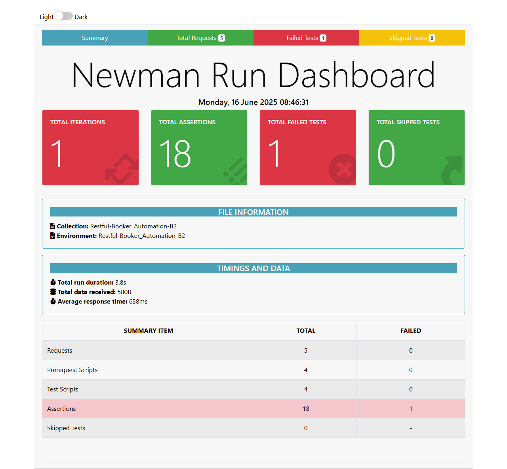
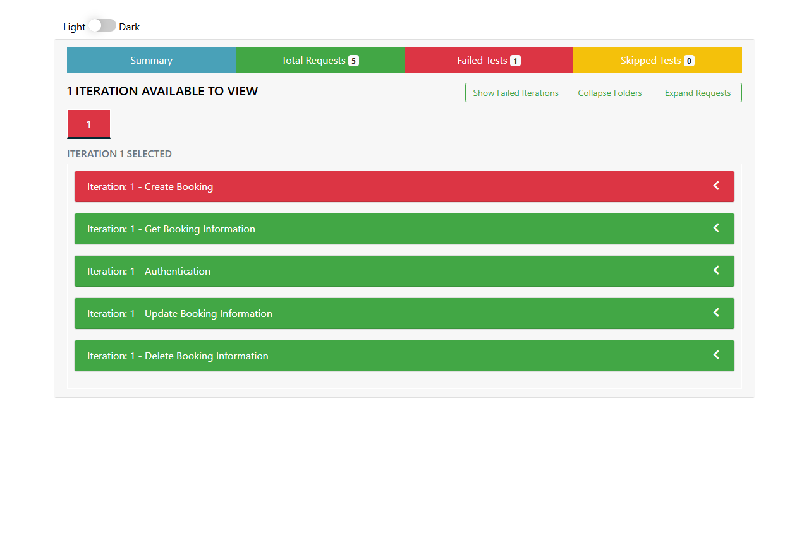
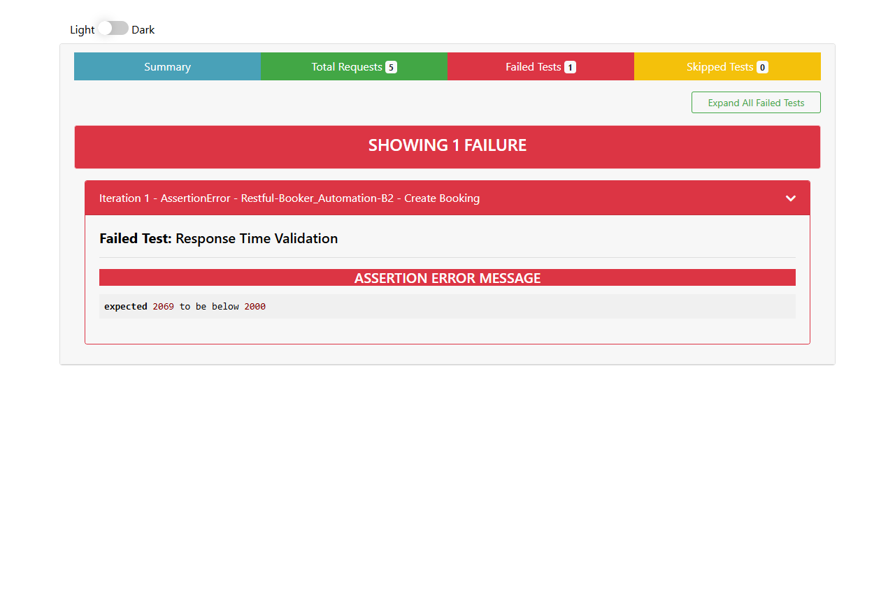

# 🧪 Restful-Booker Postman API Automation

This repository contains automated API tests for the [Restful Booker](https://restful-booker.herokuapp.com/) service using **Postman** and **Newman**.

---

## 📁 Clone the Repository

```bash
git clone https://github.com/farhadcse7/Restful-Booker-Postman-API-Automation
```

---

## ⚙️ Environment Setup

### How to Generate API Testing Report using Newman

1. **Download and Install Node.js**  
   Go to [https://nodejs.org/en](https://nodejs.org/en) and download the latest stable version of Node.js.  
   Complete the installation.

2. **Install Newman Globally**  
   Open the terminal (or Command Prompt) and run:
   ```bash
   npm install -g newman
   ```

   ✅ To check the Newman version:
   ```bash
   newman -v
   ```

3. **Install HTML Extra Reporter**  
   This reporter provides a detailed HTML report:
   ```bash
   npm install -g newman-reporter-htmlextra
   ```

4. **Run the Collection with Report Generation**  
   Navigate to the project directory and run:
   ```bash
   newman run Restful-Booker_Automation-B2.postman_collection.json -e Restful-Booker_Automation-B2.postman_environment.json -r cli,htmlextra
   ```

5. **View the Report**  
   Once the test run is completed, open the generated HTML file located in the `newman` folder to review the results.

---

## 🖼️ Sample Report Screenshots

Here are sample screenshots of the Newman HTML report:

#### 📊 Summary


#### 📥 Requests


#### ❌ Failed Tests


---

## 📌 Notes

- Ensure Postman is installed and test collections are updated before running with Newman.
- Compatible with both Windows and macOS/Linux environments.

---

Happy Testing! 🚀
